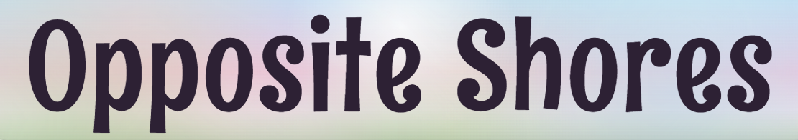

<p align="center">
  
</p>

### Opposite Shores est un jeu de stratégie et de construction urbaine compétitif au tour par tour.

## 🎮 Jouer en ligne
Le jeu est hébergé avec GitHub Pages et peut être lancé directement depuis un navigateur web :

👉 **[Jouer à Opposite Shores](https://gurultulupuding.github.io/)**

Aucune installation n’est nécessaire. Pour une meilleure expérience, il est recommandé d’utiliser un navigateur récent sur ordinateur, comme Edge ou Firefox.

## 📽️ Vidéo de gameplay

Une vidéo de gameplay du projet est disponible sur YouTube :

👉 **[Voir la vidéo de gameplay](https://youtu.be/N8zjKuY90_Y)**

## ☁️ Contexte narratif

Au-dessus des nuages roses de **Sta Garyo**, deux villes rivales se font face sur les rives opposées du fleuve **Nimro** : **Garmiyo** et **Garmamo**.

Les frères **Miyo** et **Mamo** partageaient autrefois le même rêve : construire une ville prospère, agréable et admirée de tous. Avec le temps, cette ambition commune s’est transformée en compétition.

Dans le rôle de **Miyo**, vous devez développer **Garmiyo**, organiser son expansion et dépasser **Garmamo**, la ville construite par **Mamo**, incarné par l’intelligence artificielle, sur l’autre rive.

## 🏙️ Présentation générale du jeu

Une partie dure **15 tours**.

Votre objectif est de développer **Garmiyo** et d’obtenir un score final supérieur à celui de **Garmamo**.

Le score final est calculé ainsi :

```txt
Score Final = Population + (Attraction × 1,5)
```

Une ville efficace doit trouver un équilibre entre deux ressources principales :

- la **Population**, générée par les bâtiments industriels lorsque suffisamment de capacité de population est disponible ;
- l’**Attraction**, principalement générée par les bâtiments culturels et améliorée par un urbanisme cohérent.

À la fin d’un tour, une différence d’Attraction suffisamment élevée peut provoquer une migration de population depuis la ville rivale.

## 🔁 Déroulement d’un tour

Au début de chaque tour :

1. Choisissez l’un des trois packs proposés.
2. Recevez les cartes contenues dans le pack sélectionné.
3. Placez autant de bâtiments que vous le souhaitez depuis votre main, tant que des positions légales sont disponibles.
4. Cliquez sur **End Turn** lorsque vous avez terminé.
5. Si votre main contient plus de trois cartes, défaussez les cartes nécessaires jusqu’à respecter la limite.
6. L’IA choisit à son tour un pack et développe **Garmamo** sur la rive opposée.
7. Les actions réalisées par l’IA sont révélées.
8. La migration liée à l’Attraction est calculée.
9. Cliquez sur **Next Turn** pour commencer le tour suivant.

Le joueur et l’IA reçoivent les mêmes trois propositions de packs.

Si les deux adversaires choisissent le même pack, ils obtiennent exactement les mêmes cartes.

## 🃏 Packs et gestion de la main

Trois packs sont proposés au début de chaque tour.

Les packs classiques sont :

- Résidentiel
- Industrie
- Civique
- Culture

Chaque pack classique contient **4 cartes générées aléatoirement** parmi les bâtiments de sa famille.

Un même bâtiment peut apparaître plusieurs fois dans un pack.

Le pack Infrastructure possède un contenu fixe :

```txt
3 × Road Segment
3 × Main Avenue
```

La taille maximale de la main à la fin d’un tour est de :

```txt
3 cartes
```

Le joueur peut temporairement dépasser cette limite pendant son tour, mais les cartes excédentaires doivent être défaussées avant le début du tour de l’IA.

L’action **Replace Hand** peut être utilisée une seule fois par partie. Elle remplace toutes les cartes actuellement présentes dans la main par le même nombre de cartes tirées aléatoirement.

## 🧱 Règles générales de placement

Chaque nouveau bâtiment doit :

- rester entièrement à l’intérieur de la grille
- être placé sur une zone constructible
- ne pas chevaucher une structure existante
- être connecté orthogonalement à la ville existante

Une connexion diagonale n’est pas suffisante.

L’aperçu visuel indique si le placement est autorisé :

- un aperçu vert correspond à un placement valide ;
- un aperçu rouge correspond à un placement invalide.

Appuyez sur **R** pour faire pivoter le bâtiment sélectionné avant de le placer.

## 🛣️ Placement des routes et infrastructures

Les bâtiments d’Infrastructure suivent des règles de connexion plus strictes.

Un **Road Segment** ou une **Main Avenue** doit être directement adjacent à :

- votre monument de départ ;
- une route existante ;
- ou un bâtiment civique.

Les bâtiments résidentiels, industriels et culturels ne peuvent pas servir seuls de point de départ à une nouvelle route.

Le réseau routier doit donc progresser à partir du monument, d’une route existante ou d’une structure civique adaptée.

## 🏘️ Familles de bâtiments

### Résidentiel

Les bâtiments résidentiels fournissent de la **capacité de population**, et non de la population immédiate.

Un bâtiment résidentiel :

- fournit sa capacité maximale lorsqu’il est directement connecté à une route ;
- ne fournit que 50 % de sa capacité sans accès direct à une route ;
- perd encore davantage de capacité lorsqu’il est placé près de sources de pollution.

### Industrie

Les bâtiments industriels génèrent de la **Population**.

Cette population est calculée au moment exact où le bâtiment industriel est placé.

Si la capacité disponible est insuffisante, une partie du potentiel de population est définitivement perdue. Construire des logements plus tard ne permet pas de récupérer cette perte.

Les infrastructures adjacentes améliorent la production :

```txt
Première Infrastructure adjacente : +2 Population
Deuxième Infrastructure adjacente : +1 Population supplémentaire
```

Le premier bâtiment civique adjacent apporte également :

```txt
+1 Population
```

### Infrastructure

Les bâtiments d’Infrastructure ne génèrent pas directement de score.

Ils permettent notamment de :

- débloquer la capacité maximale des logements
- soutenir les bâtiments culturels
- soutenir les bâtiments industriels
- étendre progressivement la ville

### Civique

Les bâtiments civiques jouent un rôle de soutien.

Ils peuvent :

- améliorer les bâtiments culturels proches
- soutenir les bâtiments industriels adjacents
- servir de point d’ancrage à de nouvelles routes

### Culture

Les bâtiments culturels génèrent de l’**Attraction**.

Un bâtiment culturel :

- commence avec +1 Attraction
- gagne +1 Attraction lorsqu’il est directement adjacent à un bâtiment civique
- gagne +1 Attraction lorsqu’il est directement adjacent à une route
- perd de l’Attraction lorsqu’il est placé près d’une source de pollution

## 🗂️ Catalogue des cartes

Les valeurs indiquées ci-dessous correspondent aux valeurs de base affichées sur les cartes, avant l’application des bonus et pénalités liés au placement.

Un même bâtiment peut apparaître plusieurs fois dans un pack classique.

### Cartes Résidentielles

| Carte | Forme | Capacité |
|---|---|---:|
| **Residence Small** | Case unique | 6 CAP |
| **Residence Block** | Ligne 1 × 2 | 8 CAP |
| **Courtyard Housing** | Bloc 2 × 2 | 10 CAP | 
| **Riverside Apartments** | Forme en L | 10 CAP |

### Cartes Infrastructure

Le pack Infrastructure contient toujours exactement **3 Road Segments** et **3 Main Avenues**.

| Carte | Forme |
|---|---|
| **Road Segment** | Ligne 1 × 2 | 
| **Main Avenue** | Ligne 1 × 3 |

### Cartes Industrielles

| Carte | Forme | Population | Attraction | Particularité |
|---|---|---:|---:|---|
| **Workshop** | Bloc 2 × 2 | +6 POP | −1 ATT | — |
| **Factory L** | Forme en L | +9 POP | −1 ATT | **Source de pollution** |
| **Warehouse** | Forme en U | +7 POP | −1 ATT | — |
| **Power Yard** | Petite forme en L | +8 POP | −1 ATT | **Source de pollution** |

### Cartes Civiques

| Carte | Forme |
|---|---|
| **Town Services** | Ligne 1 × 3 |
| **Emergency Services** | Ligne 1 × 2 | 
| **Broadcast Building** | Case unique |
| **Courthouse** | Bloc 2 × 2 | 

### Cartes Culturelles

| Carte | Forme | Attraction |
|---|---|---:|
| **Library** | Case unique | +1 ATT |
| **Ferris Wheel** | Bloc 2 × 2 | +1 ATT |
| **Park** | Forme en Z | +1 ATT | 
| **Museum** | Forme en T | +1 ATT |


## ✨ Attraction et migration

À la fin du tour, après la révélation des actions de l’IA, les valeurs d’Attraction des deux villes sont comparées.

Si la différence est inférieure à :

```txt
6 points d’Attraction
```

aucune migration n’a lieu.

Si cette différence atteint ou dépasse le seuil, la ville la plus attractive attire une partie de la population de la ville rivale.

Le nombre de citoyens transférés augmente selon l’écart d’Attraction, avec une limite maximale de :

```txt
3 citoyens par tour
```

Une ville ne peut évidemment pas perdre plus de population qu’elle n’en possède.

## 🧭 Contrôles et matériel requis

Le jeu peut être joué avec un clavier et une souris ou un pavé tactile.

Une souris physique est recommandée pour plus de confort, mais aucun gamepad ni matériel spécifique n’est nécessaire.

| Entrée | Action |
|---|---|
| Clic gauche | Sélectionner un pack, choisir une carte et placer un bâtiment |
| Glisser avec la souris | Faire pivoter la caméra |
| Molette ou défilement du pavé tactile | Zoomer ou dézoomer |
| W / A / S / D | Déplacer la caméra avec un clavier QWERTY |
| Z / Q / S / D | Déplacer la caméra avec un clavier AZERTY |
| Q / E | Faire pivoter la caméra avec un clavier QWERTY |
| A / E | Faire pivoter la caméra avec un clavier AZERTY |
| Flèches gauche / droite | Alternative pour faire pivoter la caméra |
| R | Faire pivoter le bâtiment sélectionné |
| Entrée | Passer l’introduction narrative |

Le type de clavier peut être modifié depuis le menu **Settings**.

Le son peut également être activé ou désactivé depuis ce menu.

## 🎵 Musique originale et sound design

Toutes les musiques et tous les effets sonores de **Opposite Shores** ont été composés et conçus spécifiquement pour ce projet.

L’identité sonore complète du jeu, incluant les sons d’interface, les sons de menu et l’ambiance procédurale de la ville, repose sur la gamme de **fa dièse mineur**.

L’ambiance musicale évolue à mesure que la ville se développe :

- chaque bâtiment non lié aux infrastructures contribue à l’ambiance sonore
- chaque famille de bâtiments possède son propre ensemble de notes
- un bâtiment nouvellement placé ajoute immédiatement un son à la ville 
- après un intervalle défini, ce bâtiment joue à nouveau une note, synchronisée sur la subdivision la plus proche de la grille musicale interne
- l’ambiance devient progressivement plus riche lorsque la ville grandit

Le système musical procédural suit un tempo interne de **50 BPM**, divisé en quatre subdivisions par temps.

Le joueur n’entend pas de métronome. Le système conserve discrètement une cohérence rythmique entre les différents sons générés par les bâtiments.

Cette mécanique a été pensée pour donner l’impression que la ville devient progressivement plus vivante sans perturber la lisibilité du gameplay.

Il est fortement recommandé de jouer avec le son activé afin de profiter pleinement de l’expérience.

## 🤖 Pourquoi Opposite Shores respecte le thème IA Edition ?

Dans **Opposite Shores**, l’intelligence artificielle n’est pas un simple élément secondaire mais elle constitue l’adversaire principal du joueur.

À chaque tour, le joueur et l’IA reçoivent exactement les mêmes trois propositions de packs de bâtiments.

L’IA doit analyser les choix disponibles, sélectionner un pack, gérer sa main et développer sa ville sur la rive opposée.

Le joueur ne construit donc pas sa ville de manière isolée. Chaque décision participe à une confrontation stratégique contre une ville rivale qui évolue tour après tour.

## 🎨 Pourquoi ce concept ?

En grandissant, j’ai toujours joué à la fois aux jeux vidéo et aux jeux de société. Cette habitude m’a naturellement exposé à de nombreux styles de jeux, à différentes mécaniques et à plusieurs manières de penser l’interaction avec le joueur.

Parmi tous ces genres, les jeux de stratégie ont toujours occupé une place particulière pour moi. Ce sont les jeux qui m’ont le plus captivé, parfois au point de vouloir y revenir chaque jour sans interruption. J’ai donc rapidement décidé que mon projet devait être un jeu de stratégie.

Les jeux de planification urbaine font également partie de mes genres préférés. J’aime l’idée de construire une ville progressivement et de devoir organiser l’espace disponible. Je me suis alors demandé comment intégrer la planification urbaine dans une vraie boucle de jeu stratégique et compétitive. C’est à partir de cette réflexion que Opposite Shores est né.

Je voulais aussi donner une place importante à la musique. Je ne souhaitais pas qu’elle soit simplement ajoutée comme une ambiance de fond indépendante du gameplay. Je voulais que la musique reflète directement la ville construite par le joueur. Chaque ville devait avoir sa propre voix. L’idée était que la ville puisse progressivement devenir plus vivante, évoluer musicalement et répondre aux décisions du joueur.

Ainsi, Opposite Shores est une combinaison de plusieurs choses qui me plaisent profondément, la stratégie, la construction urbaine, la compétition contre une IA et la musique.

D’une certaine manière, ce jeu représente une partie de ce que j’aime dans le jeu vidéo. En résumé, ce jeu me ressemble.

## 🛠️ Les principales difficultés rencontrées

La première difficulté a été de construire un ensemble de règles suffisamment clair, stratégique et équilibré.

Dans un jeu de stratégie, l’équilibrage est essentiel. Si une seule famille de bâtiments ou une seule manière de jouer devient trop forte, le joueur n’a plus réellement besoin de réfléchir et le jeu perd rapidement son intérêt. Ce travail a demandé de nombreux tests et plusieurs ajustements successifs. Après différentes itérations, j’ai réussi à atteindre un équilibre qui me satisfait davantage et qui permet plusieurs approches stratégiques.

La deuxième difficulté importante a été le développement de l’intelligence artificielle. Comme le jeu repose sur une confrontation directe entre le joueur et l’IA, il était essentiel que celle-ci soit capable de prendre des décisions cohérentes. Une IA trop faible ou trop aléatoire aurait rendu la partie peu intéressante. L’objectif n’était pas simplement de lui faire placer des bâtiments disponibles, mais de lui permettre d’évaluer les conséquences de ses choix. Créer une IA suffisamment compétitive sans lui donner d’avantages injustes a été l’un des aspects les plus complexes du projet.

La troisième difficulté a été la recherche et l’intégration des assets visuels. C’était un domaine dans lequel j’avais beaucoup moins d’expérience au début du projet.

## 🐞 Limitations connues

- Le jeu est principalement conçu pour les navigateurs sur ordinateur.
- Une souris physique est recommandée pour un contrôle plus confortable de la caméra.
- Sur les appareils moins performants, le premier chargement peut prendre davantage de temps en raison du chargement des assets 3D.
- L’IA cherche à proposer un défi stratégique, mais elle peut occasionnellement effectuer des choix sous-optimaux.
- Les effets d’éclairage restent limités.

## 💻 Technologies utilisées

- **Moteur de jeu :** Babylon.js
- **Langage :** TypeScript
- **Outil de build :** Vite
- **Hébergement :** GitHub Pages

## 🔧 Code source

👉 **[Voir le code source](https://github.com/gamesonweb/ia-edition-opposite-shores)**

## 🎨 Crédits et assets tiers

Concept du jeu, game design, programmation, interface, narration, worldbuilding, composition musicale originale, sound design, intégration technique, équilibrage et tests :

**Aral SOYSALAN**

### Assets Kenney

Certains éléments proviennent des packs suivants distribués sous licence **Creative Commons CC0** :

- City Kit (Suburban)
- City Kit (Roads)
- City Kit (Industrial)
- Game Icons

Liens :

- https://kenney.nl/assets/city-kit-suburban
- https://kenney.nl/assets/city-kit-roads
- https://kenney.nl/assets/city-kit-industrial
- https://kenney.nl/assets/game-icons

### Downtown City — Low Poly 3D Models Pack

Certains éléments du pack **Downtown City — Low Poly 3D Models Pack** créé par **ithappy** ont été utilisés conformément à la licence standard de l’Unity Asset Store.

- https://assetstore.unity.com/packages/3d/props/exterior/downtown-city-low-poly-3d-models-pack-197810

### Low-poly parisienne water fountain

Low-poly parisienne water fountain par **pino**  
Licence : **Creative Commons Attribution 4.0 International**

- Page du modèle : https://skfb.ly/oHrvq
- Licence : https://creativecommons.org/licenses/by/4.0/

## 👤 L'équipe

**Aral SOYSALAN**

